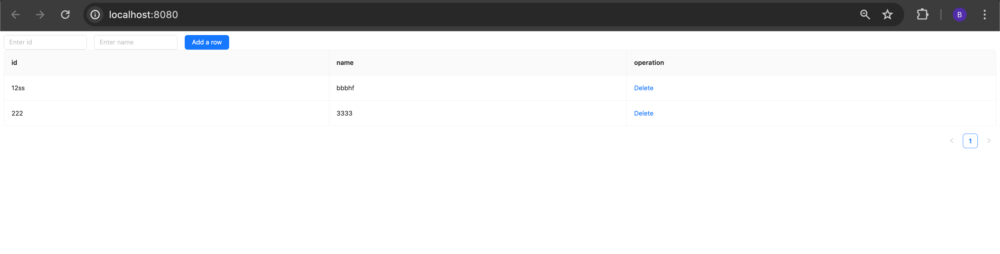

# Todo List Application

This is a simple, full-stack to-do list application built with React, Node.js, and PostgreSQL.

## Features
- Display a list of to-do items.
- Add new to-do items.
- Update existing to-do items.
- Delete to-do item

## Prerequisites
- Node.js (https://nodejs.org/) (v18 or later)
- PostgreSQL (https://www.postgresql.org/download/)
- React
- Docker

## Getting Started

### Backend
1. Navigate to the backend directory.
    
2. Install the dependencies.
    
    `npm install`
    
3. Create a .env file with your database credentials.
    
    PGUSER=your_user
    
    PGHOST=localhost
    
    PGDATABASE=your_database
    
    PGPASSWORD=your_password
    
    PGPORT=5432
    
4. Run `dokcer compose up` to init postgreDB

5. Start the backend server.
    
    `npm start`
    
The backend server will start running at http://localhost:3000.

### Frontend
1. Navigate to the frontend directory.
    
    cd frontend
    
2. Install the dependencies.
    
    npm install
    
3. Start the frontend server.
    
    npm run develop
    
Your browser should automatically open http://localhost:8080. If it doesn't, manually open the URL in your browser.

## Usage
On the frontend, you will see a list of to-do items (if any) fetched from the backend.

 You can add new to-do items using the form at the top of the page.
 
 You can edit item by clicking the field and change its value and press enter.

## Testing
To run the tests for the backend or frontend, navigate to the corresponding directory and run the following command:
npm test

## Screenshots
Todo list

